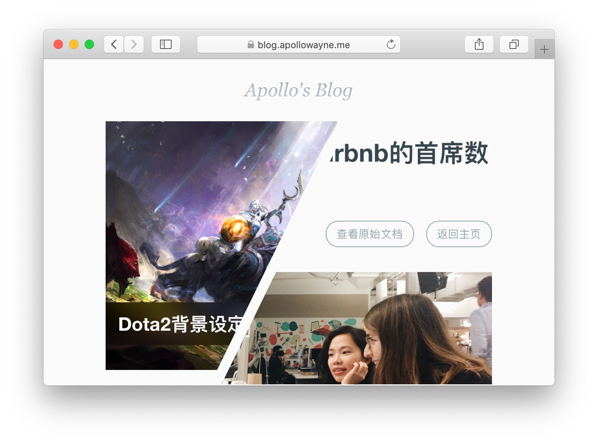

# EasyBlog - 简易的静态博客引擎（基于GitHub API）

这是一个可以将托管在GitHub上的MarkDown文档渲染为网页的简易博客引擎，由前端页面访问GitHub所提供的GraphQL API完成数据获取，无任何后端处理。前端使用[Angular](https://angular.io)框架实现，经过简单的配置即可使用。

Demo地址： https://blog.apollowayne.me

Preview:

## 功能

- 架设方便，可直接托管在GitHub Pages上，无需Nginx、Apache等服务器环境

- 配置简单，无需提供复杂的配置信息，亦无须申请API Key，只需提供公开仓库的链接信息即可

- 渲染高效，使用页面缓存、第三方CDN来提高页面访问速度

- 风格简约，没有与文章无关的任何元素

## 如何使用

1. 前往 https://github.com/Shinerising/easyblog/releases 下载最新版本的项目文件

2. 将上一步所获得的压缩包解压至静态页面托管位置（保证其中的`index.html`文件位于网络服务的主目录）

3. 按照下方的[配置说明](#_3)修改`assets/config.json`文件

4. 启动网络服务（或是向远端仓库推送文件），查看网络站点渲染效果

## 配置说明

引擎的所有配置项目均通过`assets/config.json`文件来设定，修改该文件会影响所有访问者的浏览体验，请慎重更改。

配置项目包括：

- `User` 必选，请填入GitHub公开用户名，如 `"Shinerising"`
- `Repo` 必选，请填入托管MarkDown文档的仓库名，如 `"MyArticles"`
- `Path` 必选，请填入所托管的MarkDown文档列表在仓库中的相对位置，前后不加斜杠，如 `"Articles"`
- `Title` 必选，请填入博客名称，如 `"My Blog"`
- `RAWRoot` 可选，该项可留空，可填入一些第三方CDN加速链接以加速访问（对中国大陆意义显著），如 `"https://gitcdn.xyz/cdn"`
- `Theme` 可选，该项可留空，可填入由css控制的备选主题名称，当前仅支持一款黑色主题，填入`"dark"`即可启用；可在`assets`文件夹中自行添加css文件并在设置项中填入文件名已使用自定义主题

引擎允许提供文章封面图，请将图片命名为`文章名.jpg`存放于文章同一目录中，引擎会自动显示图片。

## 其他

本项目可使用Angular-CLI进行项目管理，其余功能将会不断更新，欢迎各位提交Issue或是PR。